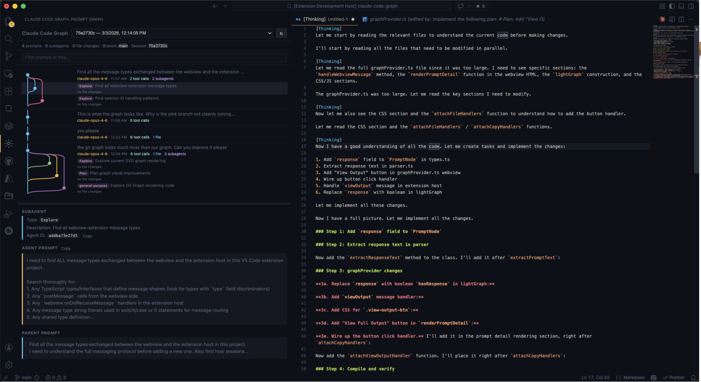

# Claude Code Graph

See what Claude actually did. Every prompt, every tool call, every subagent, every file change — rendered as an interactive graph right in your VS Code sidebar.

## Features

- **Prompt Graph** — a git-graph-style timeline of your entire Claude Code session. Each node is a prompt; branches show subagent spawns.
- **Tool Usage Tracking** — see exactly which tools Claude invoked (Read, Edit, Grep, Bash, Agent, etc.) and how many times, both in the graph timeline and in the detail panel.
- **Click to Inspect** — select any node to see the full prompt text, model used, tool breakdown, files changed, and subagent details. Copy any value with one click.
- **View Full Output** — open Claude's complete response (including thinking blocks) as a markdown document in VS Code.
- **File Diffs** — click any file change to see a side-by-side diff of exactly what was modified, using VS Code's native diff editor.
- **Session Picker** — switch between sessions with a dropdown. Works correctly across resumed and continued conversations.
- **Live Updates** — the graph refreshes automatically as Claude Code runs in your terminal.
- **Search & Filter** — filter prompts, subagents, and files to find exactly what you're looking for.

## Requirements

- VS Code 1.85+
- [Claude Code](https://docs.anthropic.com/en/docs/claude-code) — use it at least once in your workspace so transcript files exist under `~/.claude/projects/`.

## Getting Started

1. Install the extension.
2. Open a project where you've used Claude Code.
3. Click the **Claude Code Graph** icon in the Activity Bar.
4. Pick a session from the dropdown — the graph appears instantly.

## License

[MIT](LICENSE)
